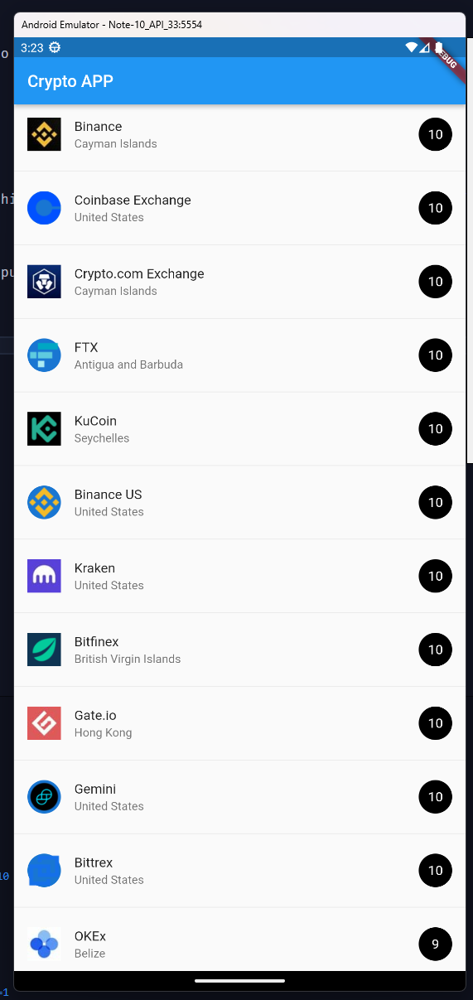

# Crypto Look

Esta aplicacion movil consta de una pantalla que muestra un listado de exchanges populares de criptodivisas.

## Temas
- ListView
- ListTile
- Json Serialization

## Lo que me costo mas trabajo
- En lugar de usar el json como string, decidi leerlo desde un archivo y luego serializarlo en una lista de objetos, lo cual fue un poco complicado ya que requirio un poco de investigacion sobre como leer archivos dentro de dart.

## Lo que aprendi
- Aprendi a serializar objetos json en objetos que pueden ser manipulados por Dart
- Aprendi a utilizar los ListView

## Screenshots de la app

## Criterio de evaluacion

| Criterio  | Puntos totales | Puntos obtenidos | Observaciones |
| ------------- | ------------- | ------------- | ------------- |
| Incluye README con las caracteristicas que se piden.  | 30  | 30  |  |
| Se muestran las imágenes en el README  | 20  |  20 |   |
| Los elementos de la lista se muestran como en la imagen proporcionada  | 30  | 30  |  |
| Se utiliza JSON Decode para convertir el String a objeto de Dart  | 10  | 10  | |
| Repositorio de GitHub | 10  | 10  |   |

